# publishing-portfolio

## 도형 로딩 애니메이션-1

<a href="http://gaeng0.dothome.co.kr/publishing%20portfolio/animation1.html" target="_blank">예제보기</a>

파일명 : animation1.html

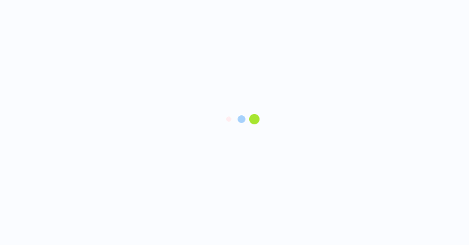

 
 

## 도형 로딩 애니메이션-2

<a href="http://gaeng0.dothome.co.kr/publishing%20portfolio/animation2.html" target="_blank">예제보기</a>

파일명 : animation2.html

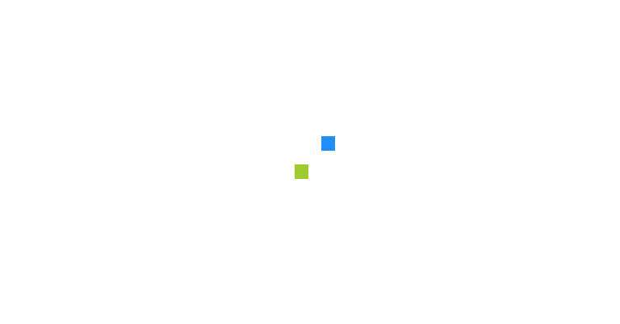

 
 

## 더블보더 레디어스 애니메이션

<a href="http://gaeng0.dothome.co.kr/publishing%20portfolio/animation3-2.html" target="_blank">예제보기</a>

파일명 : animation3-2.html

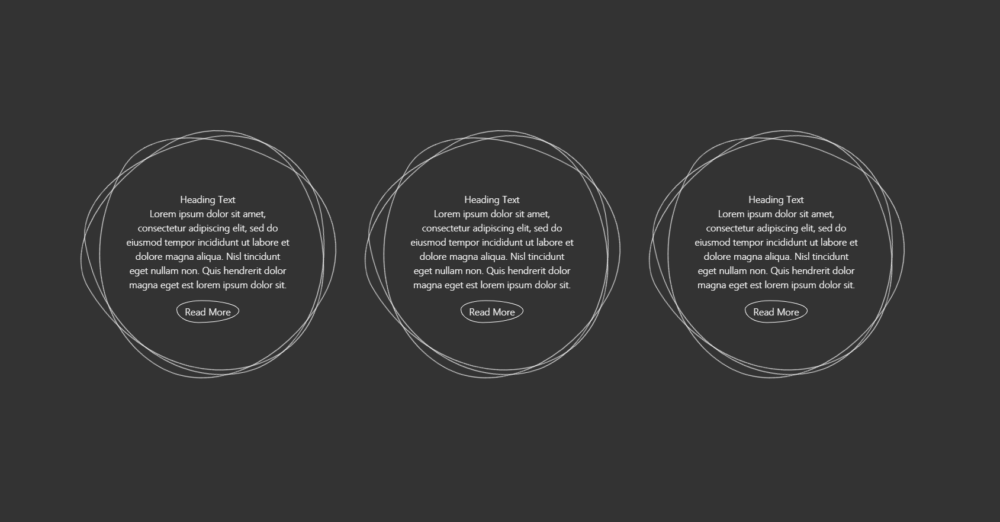

 
 

## hover하면 상세설명 나타나는 상품목록

<a href="http://gaeng0.dothome.co.kr/publishing%20portfolio/hover1.html" target="_blank">예제보기</a>

파일명 : hover1.html

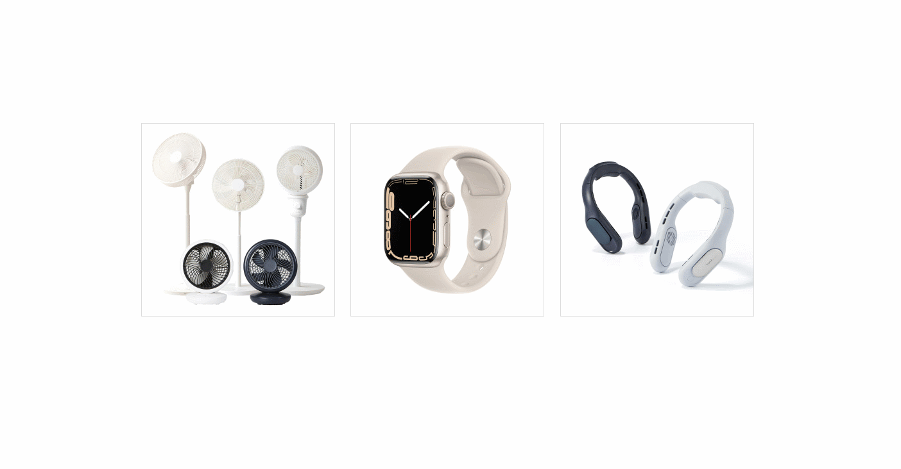

 
 

## hover되면 나타나는 툴팁

<a href="http://gaeng0.dothome.co.kr/publishing%20portfolio/hover2.html" target="_blank">예제보기</a>

파일명 : hover2.html

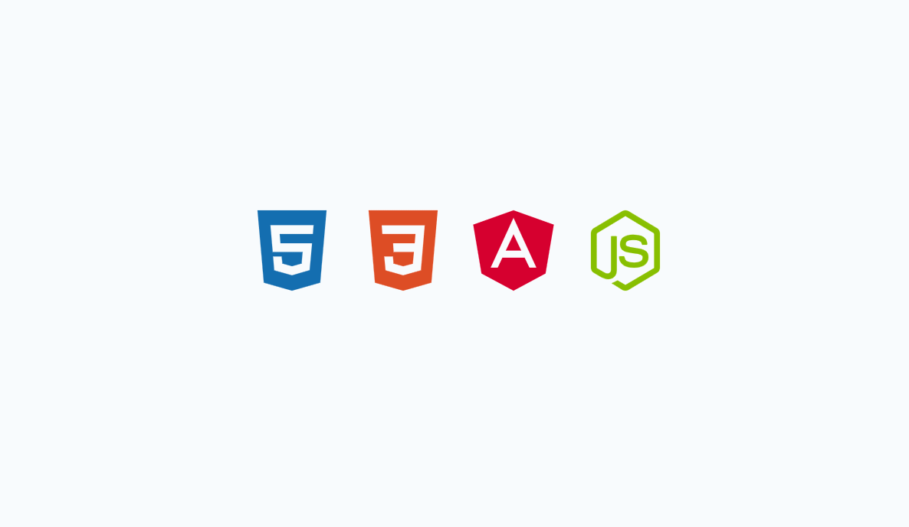

 
 

## hover한 메뉴 외 나머지 흐려지는 nav

<a href="http://gaeng0.dothome.co.kr/publishing%20portfolio/hover3.html" target="_blank">예제보기</a>

파일명 : hover3.html

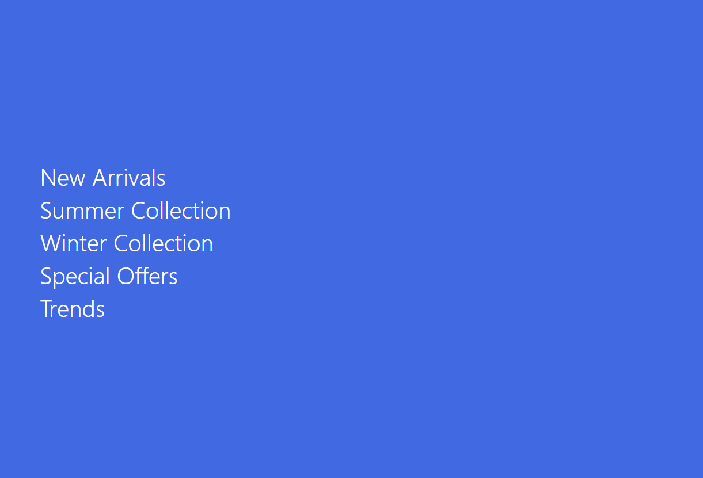

 
 

## 위아래로 분리되는 hover 네비게이션 이펙트

<a href="http://gaeng0.dothome.co.kr/publishing%20portfolio/hover4.html" target="_blank">예제보기</a>

파일명 : hover4.html

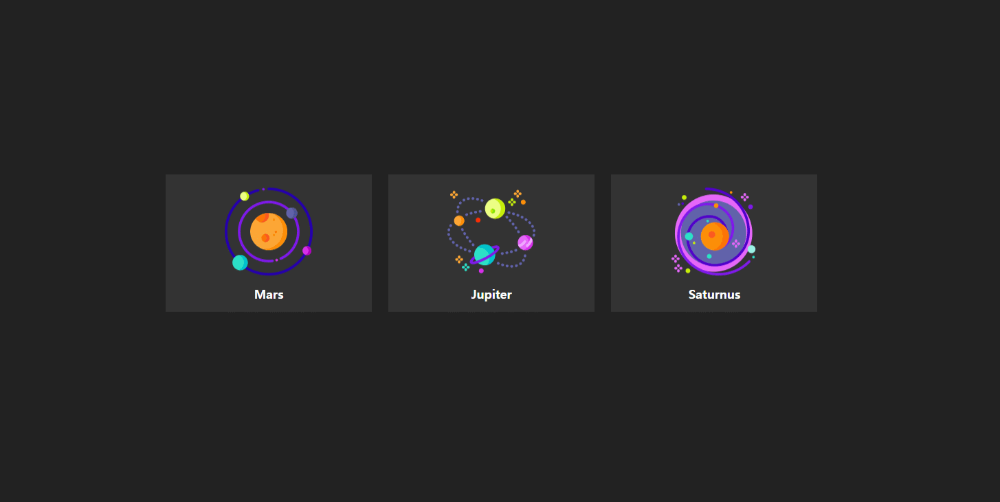

 
 

## 앱 UI 레이어 3D hover 에니메이션

<a href="http://gaeng0.dothome.co.kr/publishing%20portfolio/hover5.html" target="_blank">예제보기</a>

파일명 : hover5.html

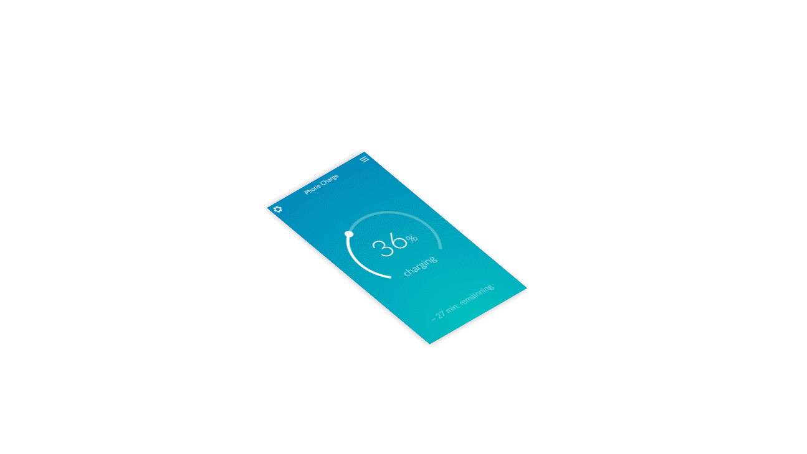

 
 

## before, after 가상클래스 활용

<a href="http://gaeng0.dothome.co.kr/publishing%20portfolio/before_after1.html" target="_blank">예제보기</a>

파일명 : before_after1.html

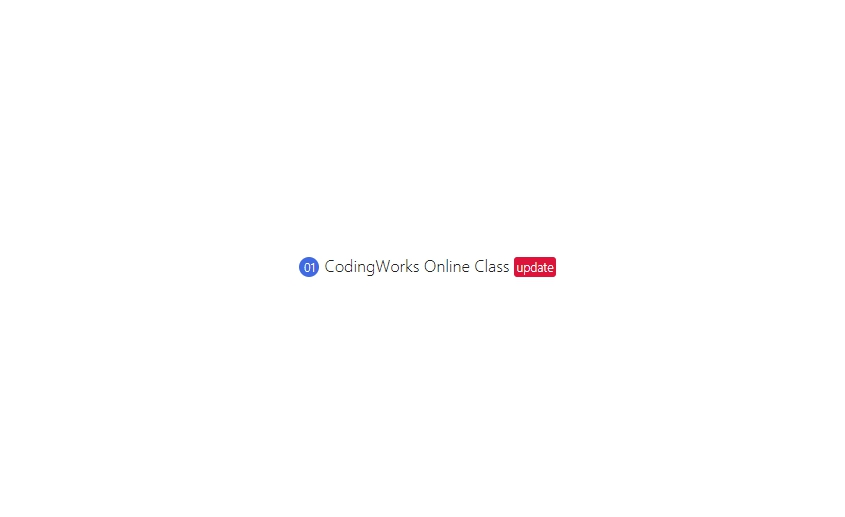

 
 

## before, after 활용한 애니메이션 hover 이펙트

<a href="http://gaeng0.dothome.co.kr/publishing%20portfolio/before_after2.html" target="_blank">예제보기</a>

파일명 : before_after2.html

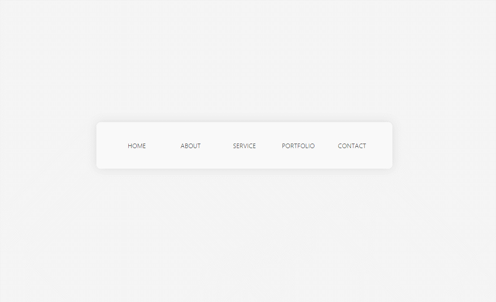

 
 

## before, after 활용 SNS 아이콘 애니메이션

<a href="http://gaeng0.dothome.co.kr/publishing%20portfolio/before_after3.html" target="_blank">예제보기</a>

파일명 : before_after3.html

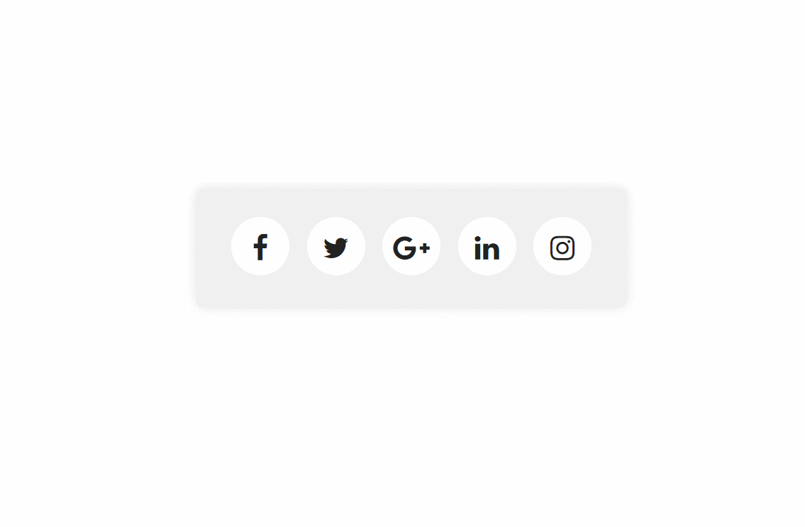

 
 

## before, after 활용 텍스트 네비게이션

<a href="http://gaeng0.dothome.co.kr/publishing%20portfolio/before_after4-2.html" target="_blank">예제보기</a>

파일명 : before_after4-1.html, before_after4-2.html

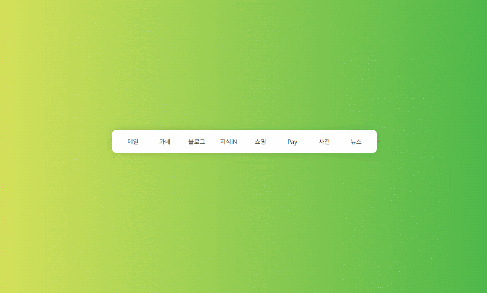

 
 

## 폰트어썸을 사용한 입력필드

<a href="http://gaeng0.dothome.co.kr/publishing%20portfolio/Fontawesome.html" target="_blank">예제보기</a>

파일명 : Fontawesome.html

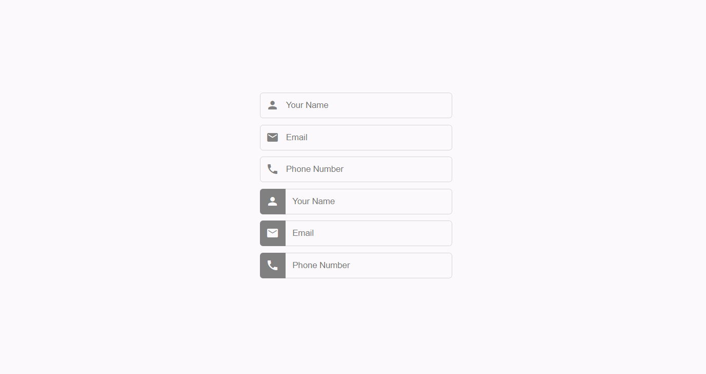

 
 

## 애니메이션 스킬 프로그래스바

<a href="http://gaeng0.dothome.co.kr/publishing%20portfolio/skill_progress1.html" target="_blank">예제보기</a>

파일명 : skill_progress1.html

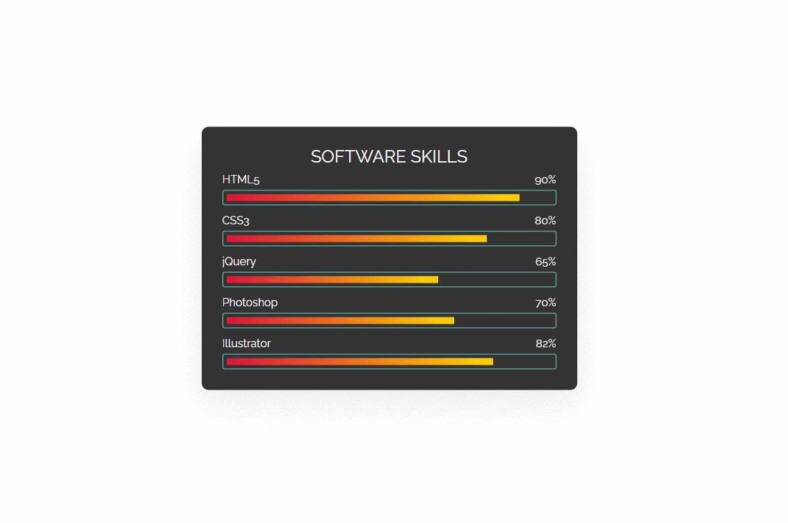

 
 

## 애니메이션 스킬 프로그래스바, delay

<a href="http://gaeng0.dothome.co.kr/publishing%20portfolio/skill_progress2.html" target="_blank">예제보기</a>

파일명 : skill_progress2.html

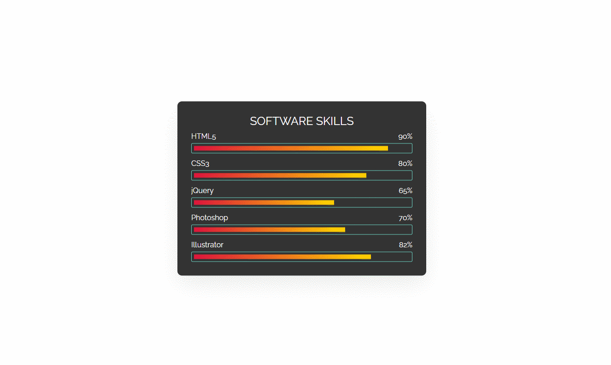

 
 

## flex layout 이미지 어코디언 네이게이션

<a href="http://gaeng0.dothome.co.kr/publishing%20portfolio/flex-layout.html" target="_blank">예제보기</a>

파일명 : flex-layout.html

 
 

## checked-애니메이션 햄버거 버튼 만들기

<a href="http://gaeng0.dothome.co.kr/publishing%20portfolio/checked1.html" target="_blank">예제보기</a>

파일명 : checked1.html

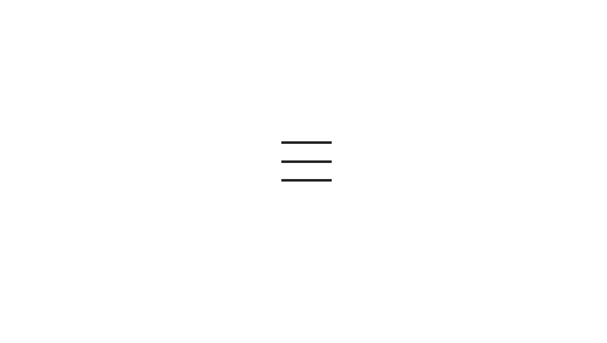

 
 

## checked-애니메이션 사이드메뉴 만들기

<a href="http://gaeng0.dothome.co.kr/publishing%20portfolio/checked2.html" target="_blank">예제보기</a>

파일명 : checked2.html

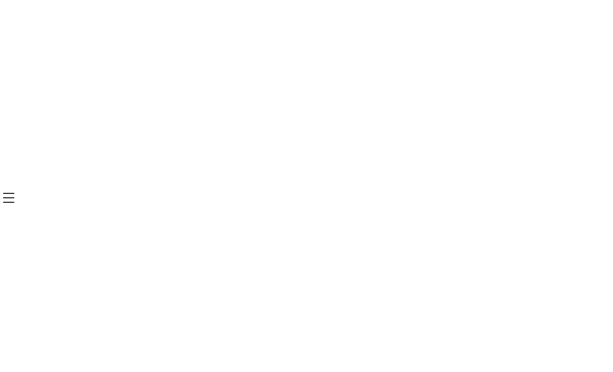

 
 

## checked-탭 메뉴 콘텐츠 만들기

<a href="http://gaeng0.dothome.co.kr/publishing%20portfolio/checked3.html" target="_blank">예제보기</a>

파일명 : checked3.html

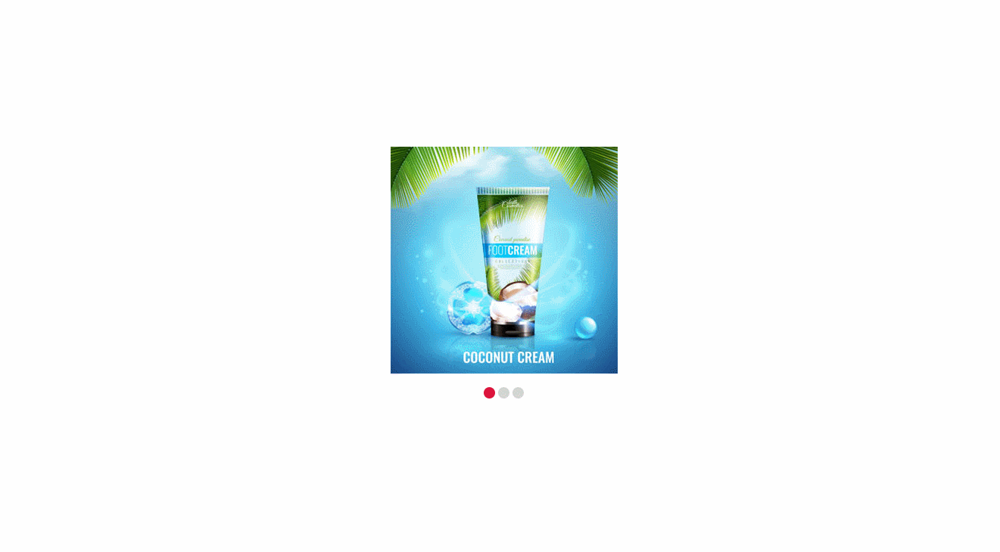

 
 

## checked-탭 콘텐츠 Opacity

<a href="http://gaeng0.dothome.co.kr/publishing%20portfolio/checked4.html" target="_blank">예제보기</a>

파일명 : checked4.html

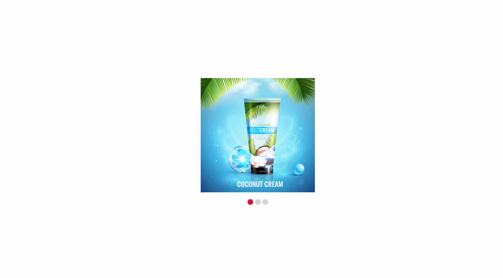

 
 

## checked-탭 콘텐츠 Opacity 응용

<a href="http://gaeng0.dothome.co.kr/publishing%20portfolio/checked5.html" target="_blank">예제보기</a>

파일명 : checked5.html

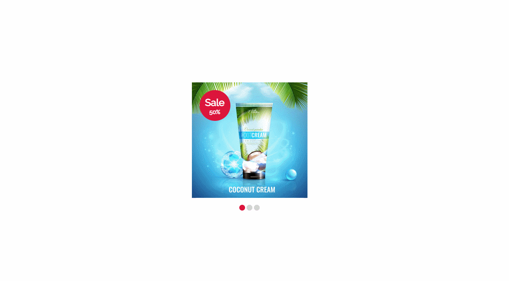

 
 

## checked-탭 콘텐츠 Slide

<a href="http://gaeng0.dothome.co.kr/publishing%20portfolio/checked6.html" target="_blank">예제보기</a>

파일명 : checked6.html

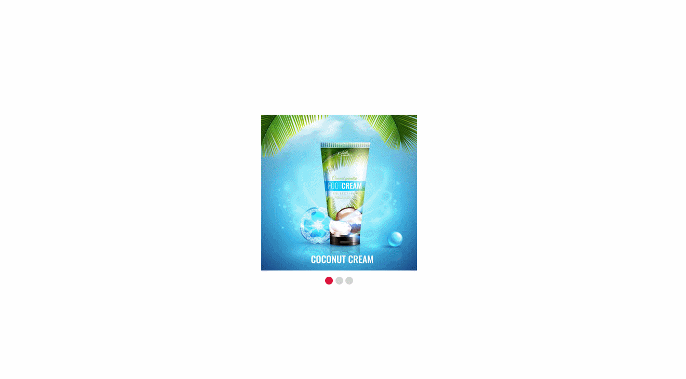

 
 

## checked-Testimonial 탭 가로,세로 슬라이더

<a href="http://gaeng0.dothome.co.kr/publishing%20portfolio/checked7-1.html" target="_blank">가로 예제보기</a>
<a href="http://gaeng0.dothome.co.kr/publishing%20portfolio/checked7-2.html" target="_blank">세로 예제보기</a>

파일명 : checked7-1.html,checked7-2.html

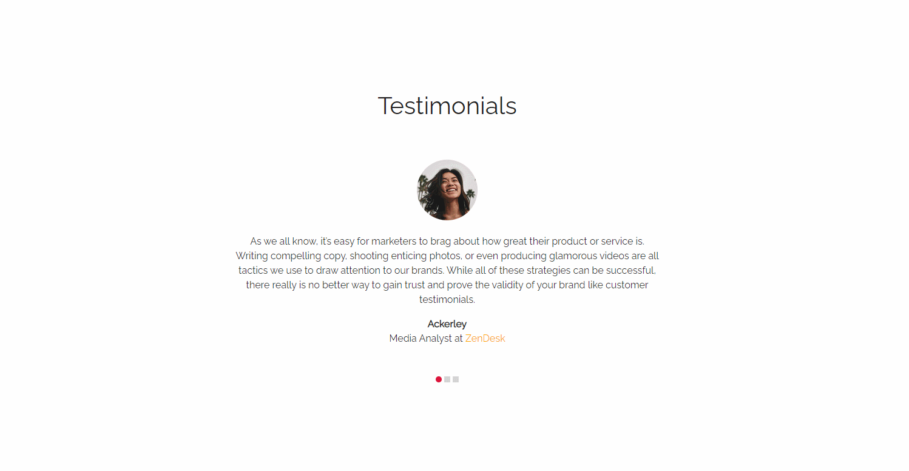

 
 

## 풀스크린 탭 콘텐츠 슬라이더 프로토타입

<a href="http://gaeng0.dothome.co.kr/publishing%20portfolio/pure1.html" target="_blank">예제보기</a>

파일명 : pure1.html

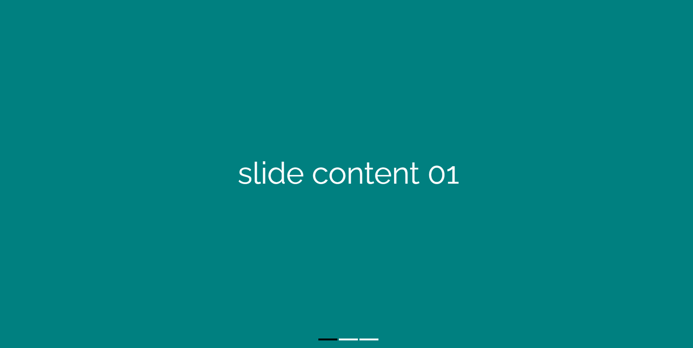

 
 

## 풀스크린 탭 콘텐츠 슬라이더 응용

<a href="http://gaeng0.dothome.co.kr/publishing%20portfolio/pure2.html" target="_blank">예제보기</a>

파일명 : pure2.html

