# publishing-portfolio

## 도형 로딩 애니메이션-1

<a href="http://gaeng0.dothome.co.kr/publishing%20portfolio/animation1.html" target="_blank">예제보기</a>

파일명 : animation1.html

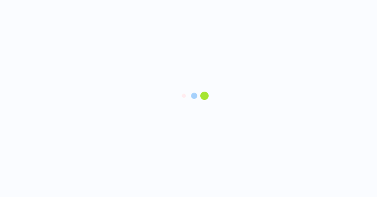

 
 

## 도형 로딩 애니메이션-2

<a href="http://gaeng0.dothome.co.kr/publishing%20portfolio/animation2.html" target="_blank">예제보기</a>

파일명 : animation2.html

 
 

## 더블보더 레디어스 애니메이션

<a href="http://gaeng0.dothome.co.kr/publishing%20portfolio/animation3-2.html" target="_blank">예제보기</a>

파일명 : animation3-2.html

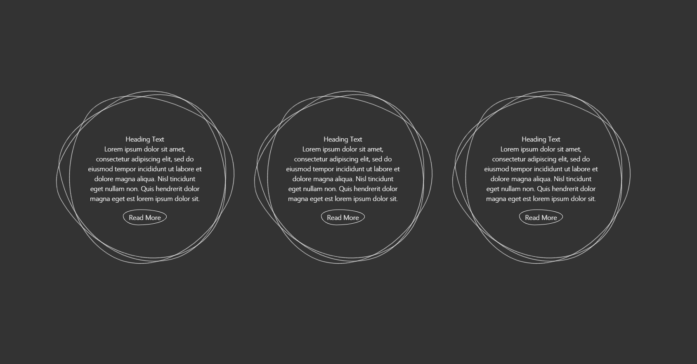

 
 

## hover하면 상세설명 나타나는 상품목록

<a href="http://gaeng0.dothome.co.kr/publishing%20portfolio/hover1.html" target="_blank">예제보기</a>

파일명 : hover1.html

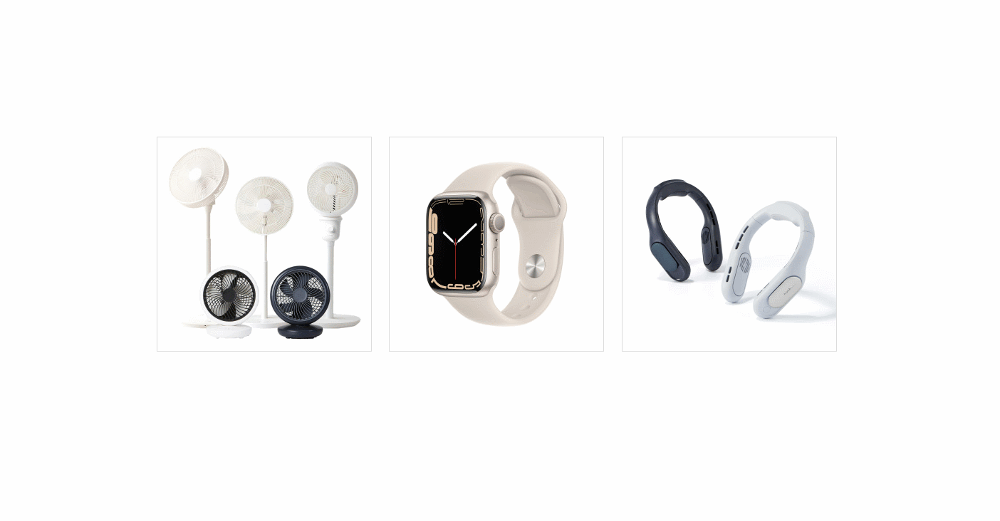

 
 

## hover되면 나타나는 툴팁

<a href="http://gaeng0.dothome.co.kr/publishing%20portfolio/hover2.html" target="_blank">예제보기</a>

파일명 : hover2.html

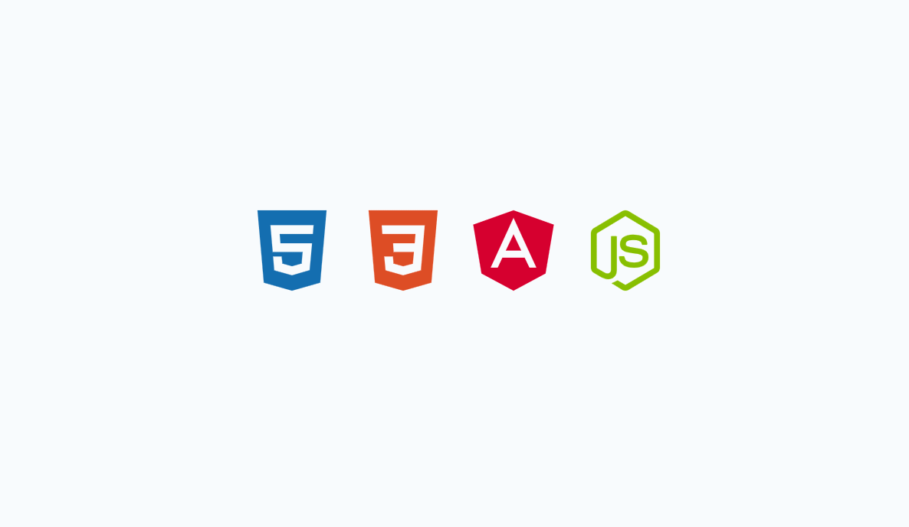

 
 

## hover한 메뉴 외 나머지 흐려지는 nav

<a href="http://gaeng0.dothome.co.kr/publishing%20portfolio/hover3.html" target="_blank">예제보기</a>

파일명 : hover3.html

 
 

## 위아래로 분리되는 hover 네비게이션 이펙트

<a href="http://gaeng0.dothome.co.kr/publishing%20portfolio/hover4.html" target="_blank">예제보기</a>

파일명 : hover4.html

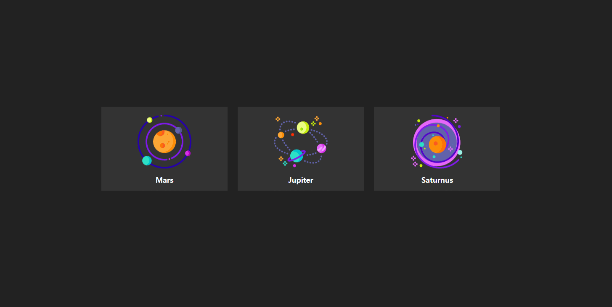

 
 

## 앱 UI 레이어 3D hover 에니메이션

<a href="http://gaeng0.dothome.co.kr/publishing%20portfolio/hover5.html" target="_blank">예제보기</a>

파일명 : hover5.html

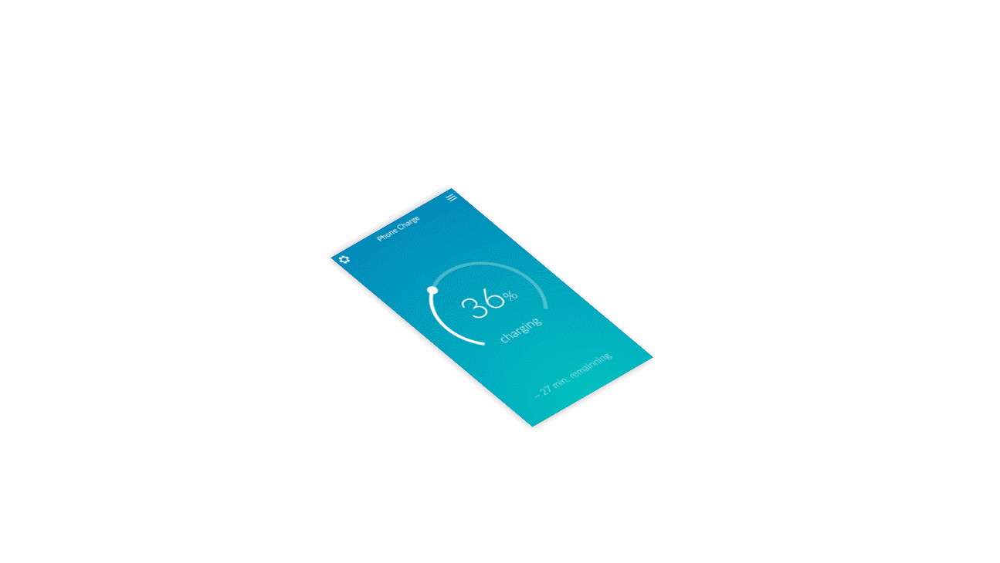

 
 

## before, after 가상클래스 활용

<a href="http://gaeng0.dothome.co.kr/publishing%20portfolio/before_after1.html" target="_blank">예제보기</a>

파일명 : before_after1.html

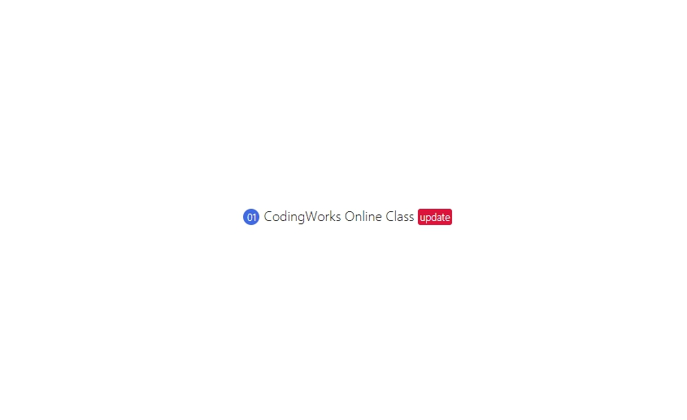

 
 

## before, after 활용한 애니메이션 hover 이펙트

<a href="http://gaeng0.dothome.co.kr/publishing%20portfolio/before_after2.html" target="_blank">예제보기</a>

파일명 : before_after2.html

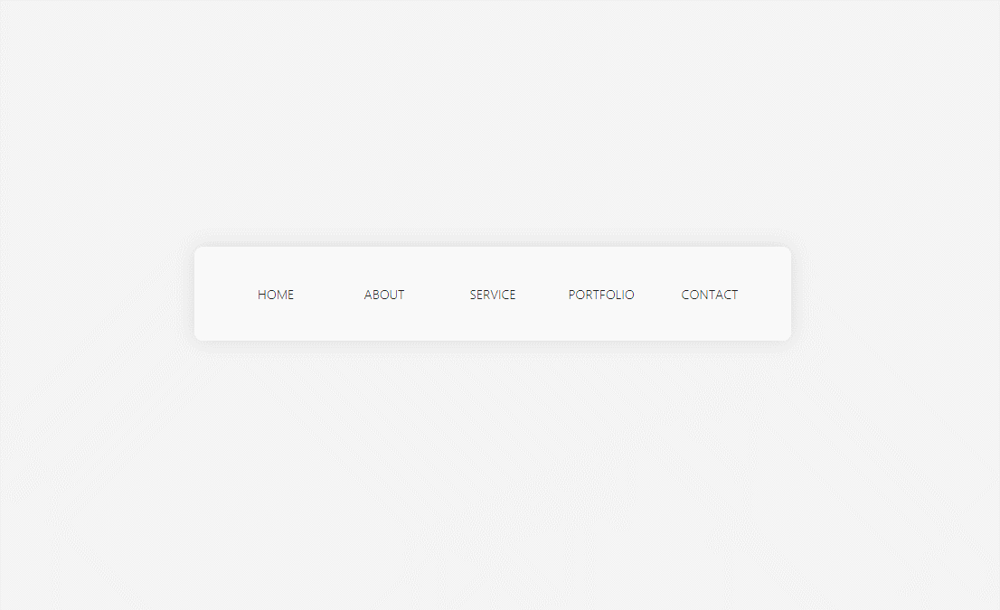

 
 

## before, after 활용 SNS 아이콘 애니메이션

<a href="http://gaeng0.dothome.co.kr/publishing%20portfolio/before_after3.html" target="_blank">예제보기</a>

파일명 : before_after3.html

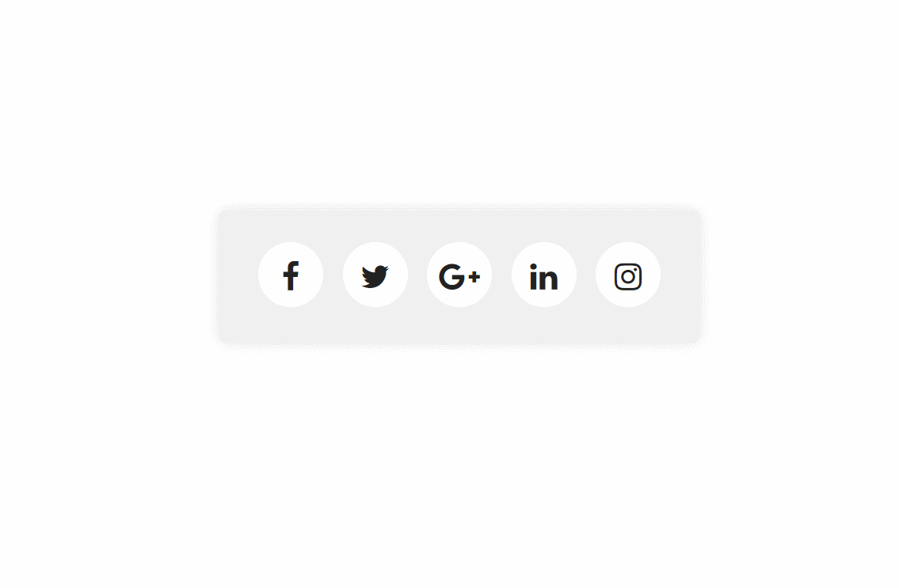

 
 

## before, after 활용 텍스트 네비게이션

<a href="http://gaeng0.dothome.co.kr/publishing%20portfolio/before_after4-2.html" target="_blank">예제보기</a>

파일명 : before_after4-1.html, before_after4-2.html

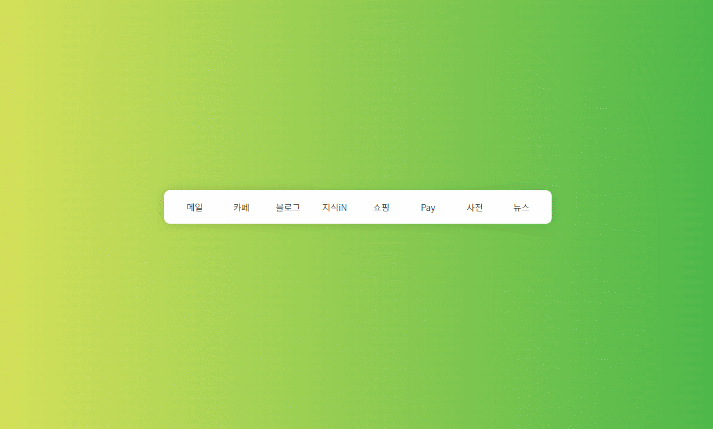

 
 

## 폰트어썸을 사용한 입력필드

<a href="http://gaeng0.dothome.co.kr/publishing%20portfolio/Fontawesome.html" target="_blank">예제보기</a>

파일명 : Fontawesome.html

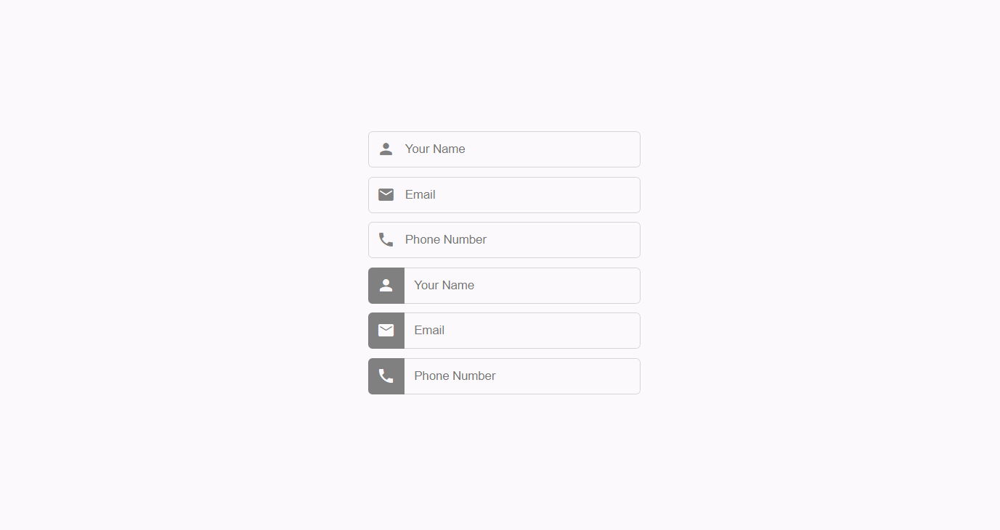
